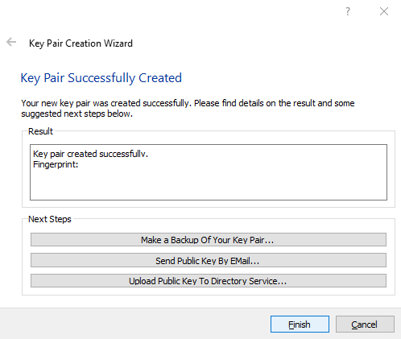

## PGP Key Setup + Email Installation

### Setting up your PGP Private Keys, with these Instructions

1. Create your PGP Private Keys, and assign to the email account you want to attach your guld username.

2. Configure your Email Client with PGP with the following installation instructions for [Linux](2-Linux.html), [MacOS](3-MacOS.html) and [Windows](4-Windows.html).
3. (Optional) Share your public key with your trusted contacts for private encrypted messages.
4. (Optional) Add your trusted contacts to your PGP Keyring to send them encrypted or signed messages. 

