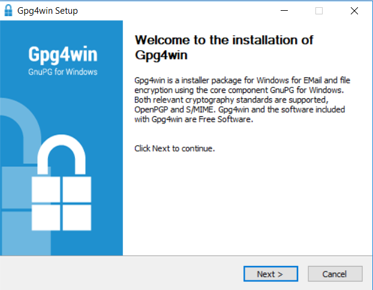

# PGP Key Setup + Email Installation

### Once you have installed the PGP client that corresponds with your OS, you can set up your PGP Keys with the following general Instructions.

## [PGP FAQ](4-FAQ.md)

#### 1. Create your PGP Private Keys, and assign to the email account you want to attach your guld username.

#### 2. Configure your Email Client with PGP with the following installation instructions for [Linux](2-Linux.md), [MacOS](3-MacOS.md) and [Windows](4-Windows.md).

#### 3. (Optional) Share your public key with your trusted contacts for private encrypted messages.

#### 4. (Optional) Add your trusted contacts to your PGP Keyring to send them encrypted or signed messages. 

